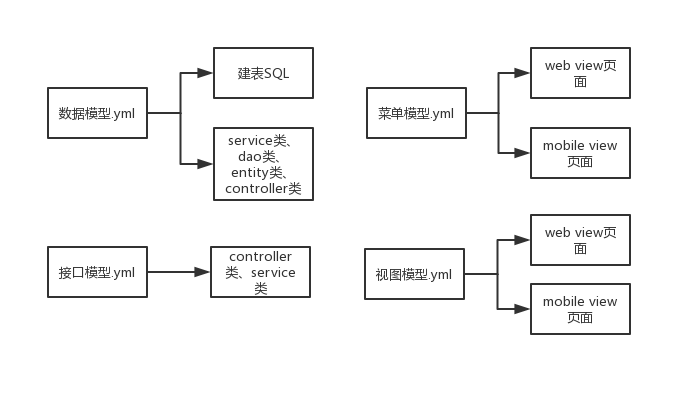

## BizMDA
BizMDA是一个基于模型驱动架构的商业应用开发平台，支持多种开发框架，通过数据建模、视图建模、服务建模、菜单建模等针对商业应用的建模，来快速支持WEB应用、APP应用和小程序的开发。

### 功能
* 根据数据模型，生成数据操作服务、建库脚本等相关代码和配置文件。
* 根据服务模型，生成服务接口代码及相关配置文件。
* 根据视图模型，生成用户界面代码以及访问后端的数据操作接口和服务接口。
* 根据菜单模型，生成功能入口的呈现代码和相关配置文件。
* 支持WEB应用、APP应用和小程序的开发。
* 支持多种开发框架和开发脚手架，并且能方便扩展到新的开发框架和开发脚手架。


### 安装
1. 从[BizMDA](https://github.com/szhengye/BizMDA)中Clone下载项目源码；
2. 在Eclipse或IDEA中作为MAVEN项目导入；
3. 将“modal/mda.yml”中关于生成代码文件和资源文件的目录，设置成你要输出的目录：
```markdown
#代码作者名
author: Steven
#代码作者邮箱
email: steven@bizmda.com
#版本号
version: V1.0
#生成代码所属java包名
packageName: com.bizmda
#生成代码文件所在目录
sourcePath: tmp/src
#生成资源文件所在目录
resourcePath: tmp/resource
#生成代码所用的模板名
template: Jeecg-Boot
```
4. 运行src/com/bizmda/CodeGen.java；
5. 你可以在你所设置的代码和资源文档输出目录中，看到生成的代码和资源文档。
6. 把生成的代码和资源文件，按要求放到对应应用框架的指定目录中，启动应用框架即可。

### 开发文档

针对BizMDA平台的使用，请参见相关[开发文档] (https://bizmda.gitbook.io/bizmda/)。